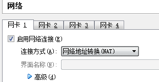
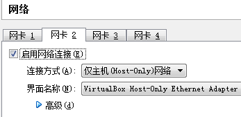
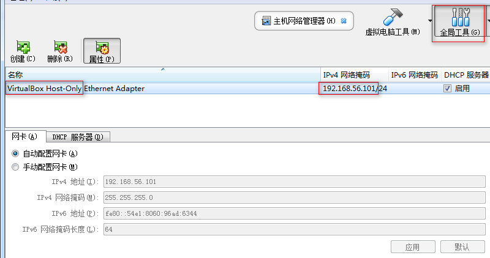

# Virtual Box内Ubuntu系统双网卡配置(Debian系适用)

## 配置VBox网络
### 1. 给ubuntu虚拟机配置双网卡，网卡1-NAT，网卡2-Host-Only。

 

### 2. 检查VBox Host-Only网卡IPV4网络掩码地址，如下图中的`192.168.56.101/24`，也可采用手动配置自行修改。



## 虚拟机内部设置
### 1. 登录虚拟机
### 2. 查看网卡名称及ip
```shell
# 查看网卡名称
$ ls /sys/class/net
enp0s3  enp0s8  lo

# 查看ip地址
$ ifconfig
enp0s3    Link encap:Ethernet  HWaddr 08:00:27:49:8b:9a
          inet addr:10.0.2.15  Bcast:10.0.2.255  Mask:255.255.255.0
          ...
enp0s8    Link encap:Ethernet  HWaddr 08:00:27:0f:88:6e
          inet addr:192.168.56.100  Bcast:192.168.56.255  Mask:255.255.255.0
          ...
lo        Link encap:Local Loopback
          inet addr:127.0.0.1  Mask:255.0.0.0
          ...

# 由IP可知：enp0s3为网卡1 NAT网络; enp0s8为网卡2 Host-Only网络; lo为本地回环网络
```
### 3. 配置静态IP
```shell
# 编辑interfaces
$ sudo vim /etc/network/interfaces
```
Then
```
# 注释有关enp0s3、enp0s8的行，在文末输入如下内容：    
auto enp0s3
iface enp0s3 inet dhcp

auto enp0s8
iface enp0s8 inet static    # 为避免客户机IP频繁变动，此处推荐用静态IP
address 192.168.56.110      # 静态IP地址，应根据 VBox Host-Only中IPV4网络掩码设置，下同
gateway 192.168.56.1
broadcast 192.168.56.255
netmask 255.255.255.0

```

### 4. 配置路由表
```shell
# 打印路由表，查看默认路由
$ route
Destination     Gateway         Genmask         Flags Metric Ref    Use Iface
default         192.168.56.1    0.0.0.0         UG    0      0        0 enp0s8
10.0.2.0        *               255.255.255.0   U     0      0        0 enp0s3
192.168.56.0    *               255.255.255.0   U     0      0        0 enp0s8
# 删除默认路由。如有多条default路由，全部删除。
$ sudo route del default

# 添加永久路由。此处采用修改rc.local方式，也可采用编辑/etc/network/interfaces, ip route add等方式添加。
$ sudo vim /etc/rc.local
# 在最后一句exit 0之前输入如下内容：
route del default
route add default gw 10.0.2.2 dev enp0s3
route del -net 192.168.56.0/24
route add -net 192.168.56.0/24 dev enp0s8

# 检查路由表
$ route
Destination     Gateway         Genmask         Flags Metric Ref    Use Iface
default         10.0.2.2        0.0.0.0         UG    0      0        0 enp0s3
10.0.2.0        *               255.255.255.0   U     0      0        0 enp0s3
192.168.56.0    *               255.255.255.0   U     0      0        0 enp0s8
```

### 5. 重启
```shell
$ sudo reboot

# 检查路由表及ip
$ route
$ ifconfig
```

完。